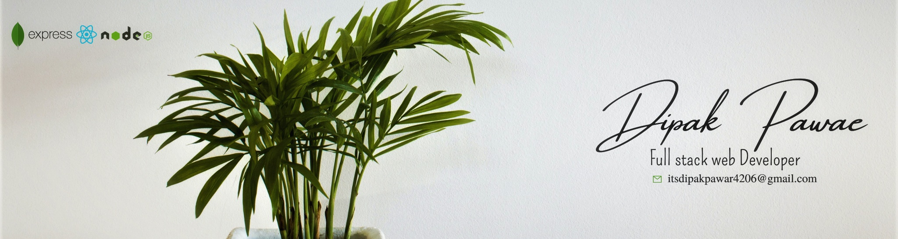

<h1 align="center">Hi 👋 I'm Dipak Pawar</h1>

---
<h3 align="center">A passionate Full Stack Web developer from Maharashtra</h3>

- 🌱 I’m currently learning **Redux**

- 👨‍💻 All of my projects are available at [https://itsdipaks.github.io/](https://itsdipaks.github.io/)

- 💬 Ask me about **React,Mongobd,express,Javascript**

- 📫 How to reach me **itsdipakpawar4206@gmail.com**

- 📄 Know about me here is my CV [resume](https://drive.google.com/file/d/1MTz7r6B5jMDNIEegsuHlVOmTiEUFdcVF/view?usp=sharing)

<h3 align="center" ><i>Let's Connect !!</i></h3>

---
 
 

# 💻 Tech Stack:
 
     
               

 

# 📊 GitHub Stats:

  

 
# 📊 Github Contribution Graph:

 

<h3 align="center">Support:</h3>

  

<h1>✍️ Developer Quote </h1>

  

 

